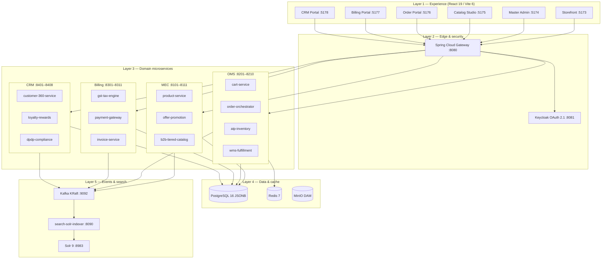
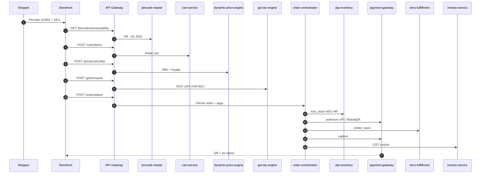
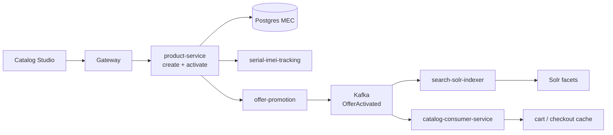
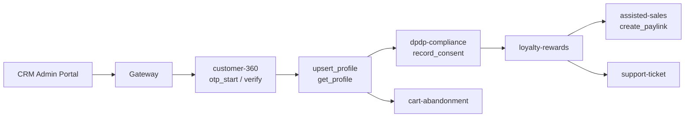
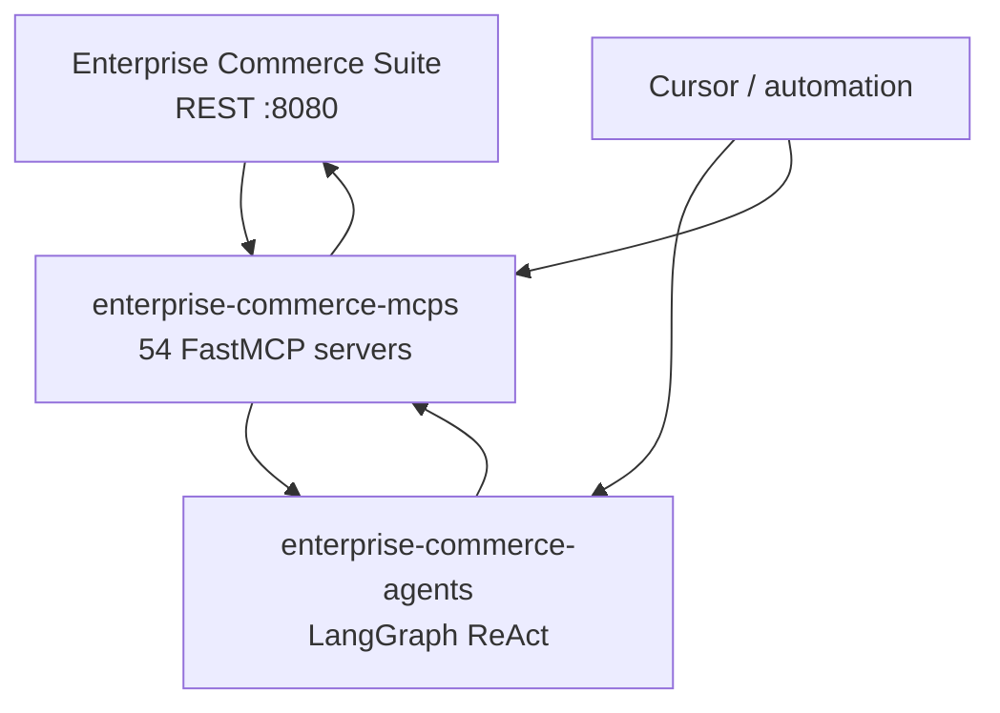
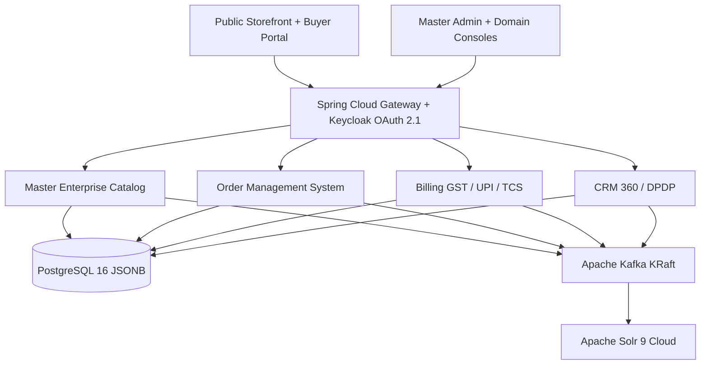

# Enterprise Commerce Suite

Open-source public project owned by **Pawan Gunjkar** (`pawangunjkar@gmail.com` · [GitHub](https://github.com/Pawangunjkar)).

Open-source enterprise e-commerce platform for the Indian commerce ecosystem. Five autonomous parent modules share contracts only through `platform-infrastructure/shared-libraries`. Licensed under MIT. See `OWNER.md` and `LICENSE`.

MCP servers: [enterprise-commerce-mcps](https://github.com/Pawangunjkar/enterprise-commerce-mcps). LangGraph business agents: [enterprise-commerce-agents](https://github.com/Pawangunjkar/enterprise-commerce-agents).

## Architecture blueprint

Enterprise Commerce Suite (ECS) is an **Indian retail + B2B commerce platform** built as 50+ Spring Boot microservices grouped into four domains (MEC, OMS, Billing, CRM). Buyers and operators use React portals; every API call goes through one gateway; business rules (GST, ATP, BharatQR, DPDP) live in Java services — not in the frontend.

> **Interactive walkthrough:** open [`docs/architecture-walkthrough.html`](docs/architecture-walkthrough.html) in a browser — each step explains **what it does**, **how data flows**, and **which APIs** are called.  
> **In-app drawer:** Master Admin portal (`:5174`) → **Architecture blueprint** button.

### How a request travels (summary)

1. **Browser** (storefront or admin portal) sends HTTPS to **API Gateway :8080**.
2. Gateway matches path (`/api/v1/products`, `/orders`, `/gst`, …) and forwards to the correct microservice port.
3. Service reads/writes **Postgres** (authoritative) or **Redis** (carts, rate limits) and may **publish Kafka events**.
4. Other services **consume events** (Solr indexer, OMS catalog consumer) — eventual consistency for search and cache.
5. Cross-domain workflows (checkout) use **order-orchestrator** calling ATP, payment, WMS, invoice over HTTP with **saga compensation** on failure.

### Layer model

Five layers — experience, edge, domain, data, events — with explicit boxes and request direction:



| Layer | Components | What it does | How traffic flows |
| --- | --- | --- | --- |
| Experience | 6 React portals | Buyer browse/checkout; ops consoles for catalog, orders, billing, CRM | axios → `:8080/api/v1/*`; TanStack Query caches GETs |
| Edge | Gateway + Keycloak | Single front door; JWT; rate limit; circuit breaker | Path-based route to `ECS_URI_*` upstream in docker-compose |
| Domain | 50+ Spring Boot JARs | Own business logic + Flyway schema per app | RestClient between services; no cross-domain Maven deps |
| Data | Postgres, Redis, MinIO | Orders, SKUs, invoices, customers; ephemeral carts | JPA write path; Redis for cart-service; MinIO for DAM |
| Events | Kafka + Solr indexer | Propagate catalog/offer changes async | CloudEvents → indexer → Solr; catalog-consumer → OMS |

#### Layer 1 — Experience (ports 5173–5178)

| Portal | Port | What it does |
| --- | --- | --- |
| `ecommerce-storefront-portal` | 5173 | Public shop: Solr facets, variant matrix, pincode EDD, BharatQR checkout |
| `master-admin-portal` | 5174 | GMV/AOV KPIs, jump to domain consoles, architecture blueprint drawer |
| `catalog-admin-studio` | 5175 | SKU create/activate, IMEI ingest, temporal offer preview |
| `order-admin-portal` | 5176 | Place order desk, WMS waves, NDR reattempt radar |
| `billing-admin-portal` | 5177 | GST/TCS views, payment ops, invoice monitoring |
| `crm-admin-portal` | 5178 | OTP desk, Customer 360 dossier, pay-links, tickets |

#### Layer 2 — Edge (`api-gateway` :8080)

The gateway **does not contain business rules**. It routes, protects, and shields downstream services:

- **Routing** — 40+ routes in `application.yml` (products, carts, orders, gst, payments, customers, …).
- **Security** — OAuth 2.1 JWT from Keycloak realm `ecs` on protected routes.
- **Resilience** — Redis token-bucket (40/s, burst 80) + Resilience4j circuit breaker per downstream.
- **WebSockets** — `/ws/payments/**` proxied to payment-gateway for live UPI status.

#### Layer 3 — Domain services (by parent folder)

| Domain | Port range | Responsibility | Example services |
| --- | --- | --- | --- |
| **MEC** | 8101–8111 | Product truth: SKUs, offers, CPQ, B2B tiers, IMEI | `product-service`, `offer-promotion-service`, `b2b-tiered-catalog-service` |
| **OMS** | 8201–8210 | Order truth: cart, saga, stock, warehouse, carriers | `cart-service`, `order-orchestrator`, `atp-inventory-service`, `wms-fulfillment-service` |
| **Billing** | 8301–8311 | Money truth: tax, payments, invoices, ledger | `gst-tax-engine`, `payment-gateway-service`, `invoice-service` |
| **CRM** | 8401–8408 | Customer truth: identity, consent, loyalty, desk | `customer-360-service`, `dpdp-compliance-service`, `assisted-sales-service` |

Domains communicate via **HTTP + Kafka only** — never compile-time imports across Maven parents.

#### Layer 4 & 5 — Data, cache, events

- **PostgreSQL 16** — separate schemas per domain; JSONB for flexible catalog attrs; `commerce_order` + `checkout_saga` in OMS.
- **Redis 7** — cart lines, price cache keys, gateway rate-limit counters.
- **Kafka KRaft** — `OfferActivatedEvent`, catalog sync, audit; consumers: Solr indexer, OMS catalog-consumer.
- **Solr 9** — faceted product search; fed by `search-solr-indexer`, read by storefront `/api/v1/search/products`.

### Gateway routing map

All external HTTP enters `:8080`. Representative routes (full list in `platform-infrastructure/api-gateway/src/main/resources/application.yml`):

| Path prefix | Domain service | Port |
| --- | --- | --- |
| `/api/v1/products/**` | product-service | 8101 |
| `/api/v1/offers/**` | offer-promotion-service | 8108 |
| `/api/v1/carts/**` | cart-service | 8201 |
| `/api/v1/orders/**` | order-orchestrator | 8203 |
| `/api/v1/inventory/**` | atp-inventory-service | 8205 |
| `/api/v1/wms/**` | wms-fulfillment-service | 8206 |
| `/api/v1/prices/**` | dynamic-price-engine | 8204 |
| `/api/v1/gst/**` | gst-tax-engine | 8301 |
| `/api/v1/payments/**` | payment-gateway-service | 8305 |
| `/api/v1/customers/**` | customer-360-service | 8401 |
| `/api/v1/search/**` | search-solr-indexer | 8090 |
| `/api/v1/pincodes/**` | pincode-master-service | 8091 |

### End-to-end flow: Delhi UPI checkout

**Story:** Shopper in Delhi (pincode `110001`) buys `SKU-PHONE-8-128-BLACK` shipped from Haryana (`NDC-HR`). Storefront prepares cart, tax, and price; `order-orchestrator` runs a **compensating saga** — if payment fails, ATP unlocks and the order is marked `FAILED`.



**Saga compensation (on failure):** unlock ATP → void payment → cancel WMS wave. State persisted in `checkout_saga` + `commerce_order`.

| Step | Service | What happens | How it connects |
| --- | --- | --- | --- |
| 1 | pincode-master | EDD + ODA for 110001; origin HR → dest DL | Drives IGST vs CGST+SGST in GST step |
| 2 | cart-service | `add_cart_item` → Redis | `cartId` passed to place_order |
| 3 | dynamic-price-engine | Offer + loyalty discounts on base INR | Taxable amount reduced before GST |
| 4 | gst-tax-engine | HSN 8517 @ 18% → IGST (inter-state) | Invoice line items use same breakdown |
| 5 | order-orchestrator | Insert order + run `SagaOrchestrator` | JDBC saga state before external calls |
| 6 | atp-inventory | `lock_stock` at NDC-HR | Short ATP throws → saga FAILED |
| 7 | payment-gateway | BharatQR + WS status; lab `simulate-success` | `txnId` linked to `orderId` |
| 8 | wms-fulfillment | Pick wave for sku/bin/qty | Warehouse ops in order-admin portal |
| 9 | invoice-service | GST invoice on capture | Billing portal visibility |

<details>
<summary><strong>Walkthrough — checkout steps (click to expand)</strong></summary>

1. **Serviceability** — `GET /api/v1/pincodes/serviceability?pincode=110001&origin=122001` returns EDD and whether the lane is serviceable. Origin warehouse state (HR) vs buyer state (DL) determines IGST.
2. **Cart** — `POST /api/v1/carts/items` with `{ cartId, sku, qty, unitPrice }` writes to Redis. Cart survives page refresh until TTL.
3. **Price** — `POST /api/v1/prices/calculate` applies `offerDiscount` and `loyaltyDiscount` on `basePrice`. Displayed INR is what the shopper pays before tax.
4. **GST** — `POST /api/v1/gst/compute` with `{ taxable, slab, originState, destState, hsn }`. Inter-state → IGST; intra-state → CGST+SGST split.
5. **Place order** — `POST /api/v1/orders/place` creates `commerce_order` and starts saga: `CART_VALIDATED → ATP_LOCKED → … → COMPLETED`.
6. **ATP lock** — Orchestrator calls `POST /api/v1/inventory/lock` — reserves stock so another checkout cannot steal the last unit.
7. **Payment** — `POST /api/v1/payments/upi/bharat-qr` returns QR + `txnId`; storefront listens on `/ws/payments/{txnId}`. Lab: `POST .../simulate-success`.
8. **Fulfillment** — `POST /api/v1/wms/waves` releases pick tasks; on capture, `invoice-service` posts compliant GST invoice.
9. **Failure** — Any step throws → reverse compensation (unlock, void, cancel wave) → order status `FAILED` with error payload.

</details>

### End-to-end flow: MEC catalog publish

**Story:** Merchandiser creates a handset SKU, activates it, ingests IMEI, publishes a festival offer — without manually syncing search or OMS. Kafka propagates changes; Solr and OMS consumer catch up asynchronously.



| Step | Service | What happens | How it connects |
| --- | --- | --- | --- |
| 1 | product-service | Draft SKU + HSN + list price INR | Postgres MEC; not searchable yet |
| 2 | product-service | `activate_product` → LIVE | Triggers sync expectations |
| 3 | serial-imei-tracking | Luhn-validated IMEI1/IMEI2 | Compliance for handsets |
| 4 | offer-promotion + CPQ | Offer rules evaluated; Kafka event | Downstream price + search |
| 5 | search-solr-indexer | Solr doc update | Storefront facets |
| 6 | catalog-consumer-service | OMS catalog cache | cart validates sku |

<details>
<summary><strong>Walkthrough — catalog steps</strong></summary>

1. **Draft SKU** — Catalog Studio → `POST /api/v1/products` with `{ sku, name, hsnCode, categoryPath, listPriceInr }`. Product id returned for activate.
2. **Activate** — `PUT /api/v1/products/{id}/activate` marks sellable. Optional `dynamic-schema-engine` validates extended JSON schema.
3. **IMEI** — `POST /api/v1/imei/ingest` with 15-digit Luhn-valid IMEI for regulated devices.
4. **Offers / CPQ** — `POST /api/v1/offers` emits `OfferActivatedEvent` to Kafka; `POST /api/v1/catalog/cpq/evaluate` checks margin rules.
5. **Search** — Indexer consumes Kafka → Solr soft commit → storefront `GET /api/v1/search/products?q=...`.
6. **OMS sync** — `catalog-consumer-service` updates cache so `cart-service` rejects deactivated SKUs at add-to-cart.

</details>

### End-to-end flow: CRM 360 assisted desk

**Story:** Store associate verifies mobile OTP, builds a Customer 360 dossier (KYC + loyalty + B2B tree), records DPDP consent, then sends a WhatsApp pay-link or opens a ticket.



| Step | Service | What happens | How it connects |
| --- | --- | --- | --- |
| 1 | customer-360 | OTP start/verify (lab `123456`) | Mobile = customerId |
| 2 | customer-360 | upsert + get profile (PAN, GSTIN) | Merged dossier for desk |
| 3 | dpdp-compliance | Purpose-bound consent | Required before pay-link / marketing |
| 4 | loyalty + accounts | Points/tier + dealer tree | Discount + B2B quote context |
| 5 | assisted-sales | WhatsApp pay-link URL | Shopper pays on own phone |
| 6 | tickets + abandonment | Desk follow-up | Recovery if checkout drops |

<details>
<summary><strong>Walkthrough — CRM steps</strong></summary>

1. **OTP** — `POST /api/v1/customers/otp/start` then `/otp/verify`. Indian mobile regex `^[6-9]\d{9}$`. Lab OTP always `123456`.
2. **KYC** — `PUT /api/v1/customers/{mobile}` with pan/gstin/name; `GET` returns dossier (OTP secret stripped).
3. **DPDP** — `POST` consent with purpose `ORDER_FULFILLMENT`, `MARKETING`, or `ASSISTED_CHECKOUT`.
4. **Loyalty + B2B** — `GET /loyalty` with optional `festivalMultiplier`; `GET /accounts/tree` for dealer hierarchy.
5. **Pay-link** — `POST /api/v1/assisted-sales/paylinks` after enrichment; returns `{ paylink, channel: WHATSAPP }`.
6. **Recovery** — `support-ticket-service` + `cart-abandonment-service` when shopper abandons assisted checkout.

</details>

### MCP + LangGraph integration

Sibling repos wrap and operate the suite — they call the **same REST APIs** as the React portals:

| Repo | Role | How it connects |
| --- | --- | --- |
| [enterprise-commerce-mcps](https://github.com/Pawangunjkar/enterprise-commerce-mcps) | 54 FastMCP stdio servers | Each tool → HTTP → gateway → microservice |
| [enterprise-commerce-agents](https://github.com/Pawangunjkar/enterprise-commerce-agents) | LangGraph ReAct operators | MCP tools + enrichment playbooks in prompts |



YAML scenarios in `enterprise-commerce-agents/scenarios/` execute ordered MCP chains against a running suite:

| Scenario | What it demonstrates |
| --- | --- |
| `checkout-delhi-upi` | Pincode → cart → GST → saga → BharatQR → payment confirm |
| `mec-catalog-lifecycle` | Create SKU → activate → IMEI → Solr search |
| `crm-assisted-sales-paylink` | Profile → loyalty → consent → pay-link |
| `oms-order-to-fulfillment` | Order → ATP → WMS → carrier → NDR |

Run: `uv run ecs-agents scenario run checkout-delhi-upi` (requires suite + MCPs up).

### Shared contracts

Domain modules **must not** depend on each other directly. Cross-cutting behavior lives in `platform-infrastructure/shared-libraries/`:

| Library | Used for |
| --- | --- |
| `common-core` | `ApiResponse`, exceptions, RestClient |
| `common-events` | Kafka CloudEvent envelopes + topic names |
| `saga-orchestration` | Checkout saga step runner + compensation |
| `payment-spi` | BharatQR factory + UPI intents |
| `logistics-spi` | Carrier waybill adapters |
| `ondc-beckn-spi` | ONDC seller gateway |

## Architecture (overview diagram)



## Module map

| Parent folder | Responsibility |
| --- | --- |
| `platform-infrastructure/` | Gateway, Keycloak realm, Solr indexer, pincode, notifications, DLQ, MCA audit, shared libraries, React 19 monorepo |
| `master-enterprise-catalog/` | SKU lifecycle, variants, IMEI, CPQ, offers, temporal activation, DAM, bulk import |
| `order-management-system/` | Cart, checkout, saga, dynamic price, ATP, WMS, ONDC, carriers, NDR, BOPIS |
| `billing-system/` | GST CGST/SGST vs IGST, TCS 194O, BharatQR, plugins, invoices, GAAP ledger, dunning |
| `customer-relationship-management/` | Mobile OTP, assisted sales, B2B trees, tickets, loyalty, cart recovery, DPDP |

## Local quickstart

Infrastructure only (Postgres, Redis, Kafka, Solr, MinIO, Keycloak):

```bash
docker compose -f docker-compose.infra.yml up -d
```

All microservices + portals (package JARs first — this starts every Spring Boot app together):

```bash
mvn -DskipTests package
docker compose -f docker-compose.infra.yml -f docker-compose.apps.yml up -d --build
```

Then open http://localhost:5173 (storefront) and http://localhost:8080 (API gateway).

Host-mode Java (without app containers):

```bash
mvn -pl platform-infrastructure/api-gateway spring-boot:run
cd platform-infrastructure/frontend-monorepo
npm install
npm run dev --workspace=ecommerce-storefront-portal
```

Standalone domain build:

```bash
mvn -f master-enterprise-catalog/pom.xml clean install
mvn -Pbuild-oms -DskipTests install
```

Keycloak: http://localhost:8081 (`admin` / `admin`), realm `ecs`.
Solr: http://localhost:8983/solr/#/products
Storefront: http://localhost:5173
Master admin: http://localhost:5174

## India-specific engines

- **GST**: intra-state `CGST+SGST`, inter-state `IGST`, slabs 0/5/12/18/28, e-way bill payload when taxable value exceeds ₹50,000.
- **TCS**: Section 194O 1% on GMV.
- **UPI**: Dynamic BharatQR `upi://pay?pa=...&cu=INR` with Base64 PNG and intent URLs for GPay / PhonePe / Paytm / CRED.
- **Pincode**: serviceability, ODA flag, EDD from origin vs destination state.
- **IMEI**: 15-digit Luhn validation on ingest.
- **OMS checkout saga**: persists `commerce_order` + `checkout_saga`, then ATP lock → UPI authorize (or COD) → WMS wave → capture + GST invoice, with compensating unlock/void/cancel.
- **Cross-sell / up-sell**: `POST /api/v1/recommendations` ranks affinity rules (frequently bought together) plus a same-family SKU ladder.
- **DPDP Act 2023**: consent capture and anonymization endpoints.

## Frontend suite

Turborepo under `platform-infrastructure/frontend-monorepo/`:

- `ecommerce-storefront-portal` — faceted search, variant matrix, festival countdown, pincode EDD, BharatQR checkout, order radar
- `master-admin-portal` — GMV/AOV KPIs and console switcher
- `catalog-admin-studio`, `order-admin-portal`, `billing-admin-portal`, `crm-admin-portal`

## Tech stack

Java 21 virtual-thread ready, Spring Boot 3.3.5, Spring Cloud 2023.0.3, PostgreSQL 16, Kafka KRaft, Solr 9.7, Redis 7, Keycloak 24, React 19, Vite 6, Tailwind, TanStack Query.

Caffeine local cache (pincode, product, GST, prices) plus Redis for carts/price keys. Inbound Redis token-bucket on the gateway; outbound Resilience4j rate limiter + circuit breaker on every RestClient call to another microservice.

## Owner

- Name: Pawan Gunjkar
- Email: pawangunjkar@gmail.com
- GitHub: https://github.com/Pawangunjkar
- Visibility: public open source (MIT)

