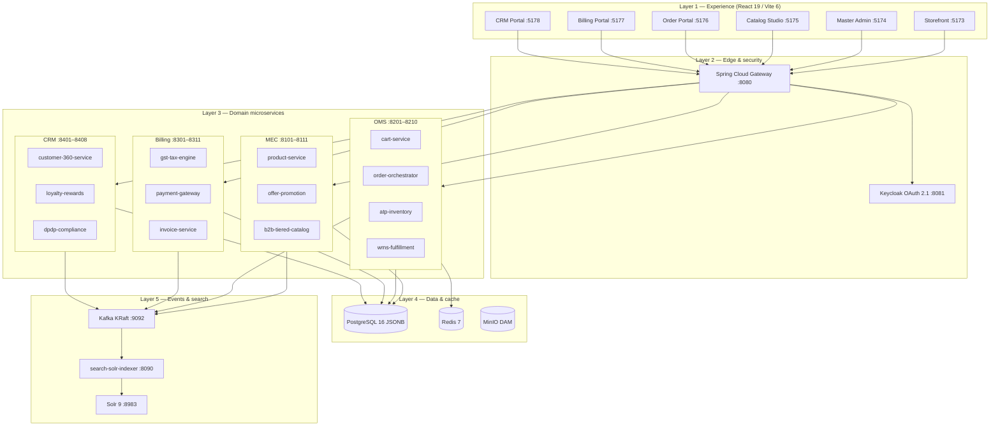
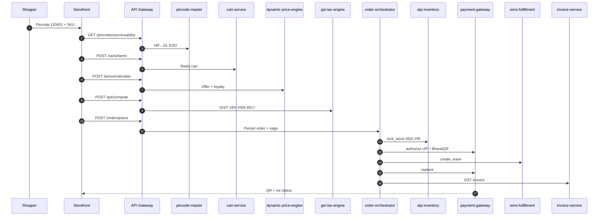
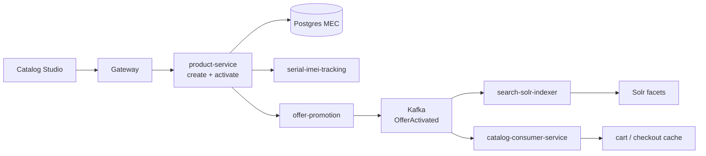
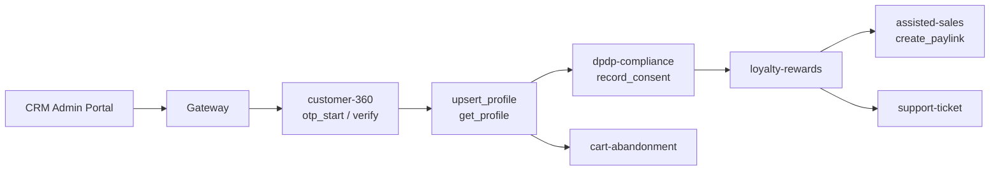
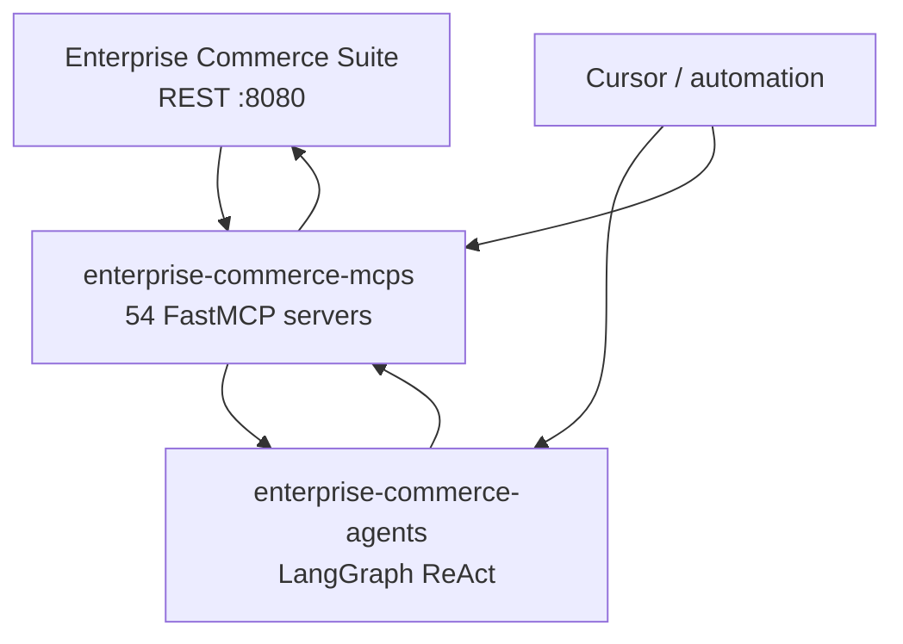
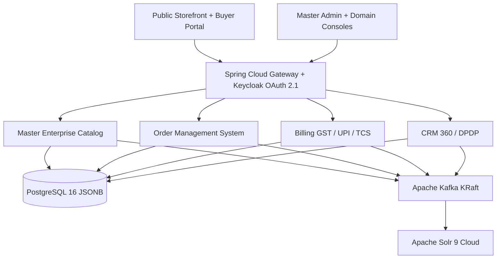

# Enterprise Commerce Suite

Open-source public project owned by **Pawan Gunjkar** (`pawangunjkar@gmail.com` · [GitHub](https://github.com/Pawangunjkar)).

Open-source enterprise e-commerce platform for the Indian commerce ecosystem. Five autonomous parent modules share contracts only through `platform-infrastructure/shared-libraries`. Licensed under MIT. See `OWNER.md` and `LICENSE`.

MCP servers: [enterprise-commerce-mcps](https://github.com/Pawangunjkar/enterprise-commerce-mcps). LangGraph business agents: [enterprise-commerce-agents](https://github.com/Pawangunjkar/enterprise-commerce-agents).

## Architecture blueprint

> **Interactive walkthrough:** open [`docs/architecture-walkthrough.html`](docs/architecture-walkthrough.html) in a browser (Previous/Next, five flows).  
> **In-app drawer:** Master Admin portal (`:5174`) → **Architecture blueprint** button (same flows, slide-over panel).

### Layer model

Five layers — experience, edge, domain, data, events — with explicit boxes and request direction:



| Layer | Components | Role |
| --- | --- | --- |
| Experience | 6 React portals | Buyer + operator UX; TanStack Query → gateway |
| Edge | Gateway + Keycloak | Route `/api/v1/*`, JWT, CORS, Redis rate limit, circuit breaker |
| Domain | 50+ Spring Boot JARs | MEC / OMS / Billing / CRM bounded contexts |
| Data | Postgres, Redis, MinIO | Authoritative state, carts/prices, media assets |
| Events | Kafka + Solr indexer | CloudEvents catalog/offer/order; faceted search |

### Gateway routing map

All external HTTP enters `:8080`. Representative routes (full list in `platform-infrastructure/api-gateway/src/main/resources/application.yml`):

| Path prefix | Domain service | Port |
| --- | --- | --- |
| `/api/v1/products/**` | product-service | 8101 |
| `/api/v1/offers/**` | offer-promotion-service | 8108 |
| `/api/v1/carts/**` | cart-service | 8201 |
| `/api/v1/orders/**` | order-orchestrator | 8203 |
| `/api/v1/inventory/**` | atp-inventory-service | 8205 |
| `/api/v1/wms/**` | wms-fulfillment-service | 8206 |
| `/api/v1/prices/**` | dynamic-price-engine | 8204 |
| `/api/v1/gst/**` | gst-tax-engine | 8301 |
| `/api/v1/payments/**` | payment-gateway-service | 8305 |
| `/api/v1/customers/**` | customer-360-service | 8401 |
| `/api/v1/search/**` | search-solr-indexer | 8090 |
| `/api/v1/pincodes/**` | pincode-master-service | 8091 |

### End-to-end flow: Delhi UPI checkout



**Saga compensation (on failure):** unlock ATP → void payment → cancel WMS wave. State persisted in `checkout_saga` + `commerce_order`.

<details>
<summary><strong>Walkthrough — checkout steps (click to expand)</strong></summary>

1. **Serviceability** — `pincode-master-service` returns EDD and ODA for origin warehouse vs buyer pincode.
2. **Cart** — `cart-service` writes lines to Redis (`cartId`, SKU, unit price INR).
3. **Price** — `dynamic-price-engine` applies offer + loyalty discounts.
4. **GST** — `gst-tax-engine` chooses CGST+SGST (intra-state) or IGST (inter-state).
5. **Place order** — `order-orchestrator` creates draft order and runs `SagaOrchestrator`.
6. **ATP lock** — `atp-inventory-service` reserves stock; short ATP aborts saga.
7. **Payment** — `payment-gateway-service` mints BharatQR; lab uses `simulate-success`.
8. **Fulfillment** — `wms-fulfillment-service` releases pick wave; `invoice-service` posts tax invoice.

</details>

### End-to-end flow: MEC catalog publish



<details>
<summary><strong>Walkthrough — catalog steps</strong></summary>

1. **Draft SKU** — HSN, category path, list price INR in `product-service`.
2. **Activate** — PUT `/products/{id}/activate`; optional `dynamic-schema-engine` validation.
3. **IMEI** — 15-digit Luhn check for handset serials.
4. **Offers / CPQ** — `offer-promotion-service` + `cpq-rule-engine` emit Kafka CloudEvents.
5. **Search** — indexer updates Solr; storefront faceted browse reads `/api/v1/search/products`.
6. **OMS sync** — `catalog-consumer-service` hydrates cart/checkout catalog view.

</details>

### End-to-end flow: CRM 360 assisted desk



<details>
<summary><strong>Walkthrough — CRM steps</strong></summary>

1. **OTP** — Mobile is customer id; lab OTP `123456`.
2. **KYC** — PAN, GSTIN, name merged in profile store; GET returns dossier without OTP secret.
3. **DPDP** — Purpose-limited consent (ORDER, MARKETING, ASSISTED_CHECKOUT).
4. **Loyalty + B2B** — Festival multiplier; `account-hierarchy-service` tree for dealers.
5. **Pay-link / ticket** — WhatsApp pay-link or support ticket for assisted sales desk.

</details>

### MCP + LangGraph integration



YAML scenarios in `enterprise-commerce-agents/scenarios/` execute ordered MCP tool chains (checkout, catalog, CRM, fulfillment) against live suite APIs.

### Shared contracts

Domain modules **must not** depend on each other directly. Cross-cutting behavior lives in `platform-infrastructure/shared-libraries/`:

| Library | Used for |
| --- | --- |
| `common-core` | `ApiResponse`, exceptions, RestClient |
| `common-events` | Kafka CloudEvent envelopes + topic names |
| `saga-orchestration` | Checkout saga step runner + compensation |
| `payment-spi` | BharatQR factory + UPI intents |
| `logistics-spi` | Carrier waybill adapters |
| `ondc-beckn-spi` | ONDC seller gateway |

## Architecture (overview diagram)



## Module map

| Parent folder | Responsibility |
| --- | --- |
| `platform-infrastructure/` | Gateway, Keycloak realm, Solr indexer, pincode, notifications, DLQ, MCA audit, shared libraries, React 19 monorepo |
| `master-enterprise-catalog/` | SKU lifecycle, variants, IMEI, CPQ, offers, temporal activation, DAM, bulk import |
| `order-management-system/` | Cart, checkout, saga, dynamic price, ATP, WMS, ONDC, carriers, NDR, BOPIS |
| `billing-system/` | GST CGST/SGST vs IGST, TCS 194O, BharatQR, plugins, invoices, GAAP ledger, dunning |
| `customer-relationship-management/` | Mobile OTP, assisted sales, B2B trees, tickets, loyalty, cart recovery, DPDP |

## Local quickstart

Infrastructure only (Postgres, Redis, Kafka, Solr, MinIO, Keycloak):

```bash
docker compose -f docker-compose.infra.yml up -d
```

All microservices + portals (package JARs first — this starts every Spring Boot app together):

```bash
mvn -DskipTests package
docker compose -f docker-compose.infra.yml -f docker-compose.apps.yml up -d --build
```

Then open http://localhost:5173 (storefront) and http://localhost:8080 (API gateway).

Host-mode Java (without app containers):

```bash
mvn -pl platform-infrastructure/api-gateway spring-boot:run
cd platform-infrastructure/frontend-monorepo
npm install
npm run dev --workspace=ecommerce-storefront-portal
```

Standalone domain build:

```bash
mvn -f master-enterprise-catalog/pom.xml clean install
mvn -Pbuild-oms -DskipTests install
```

Keycloak: http://localhost:8081 (`admin` / `admin`), realm `ecs`.
Solr: http://localhost:8983/solr/#/products
Storefront: http://localhost:5173
Master admin: http://localhost:5174

## India-specific engines

- **GST**: intra-state `CGST+SGST`, inter-state `IGST`, slabs 0/5/12/18/28, e-way bill payload when taxable value exceeds ₹50,000.
- **TCS**: Section 194O 1% on GMV.
- **UPI**: Dynamic BharatQR `upi://pay?pa=...&cu=INR` with Base64 PNG and intent URLs for GPay / PhonePe / Paytm / CRED.
- **Pincode**: serviceability, ODA flag, EDD from origin vs destination state.
- **IMEI**: 15-digit Luhn validation on ingest.
- **OMS checkout saga**: persists `commerce_order` + `checkout_saga`, then ATP lock → UPI authorize (or COD) → WMS wave → capture + GST invoice, with compensating unlock/void/cancel.
- **Cross-sell / up-sell**: `POST /api/v1/recommendations` ranks affinity rules (frequently bought together) plus a same-family SKU ladder.
- **DPDP Act 2023**: consent capture and anonymization endpoints.

## Frontend suite

Turborepo under `platform-infrastructure/frontend-monorepo/`:

- `ecommerce-storefront-portal` — faceted search, variant matrix, festival countdown, pincode EDD, BharatQR checkout, order radar
- `master-admin-portal` — GMV/AOV KPIs and console switcher
- `catalog-admin-studio`, `order-admin-portal`, `billing-admin-portal`, `crm-admin-portal`

## Tech stack

Java 21 virtual-thread ready, Spring Boot 3.3.5, Spring Cloud 2023.0.3, PostgreSQL 16, Kafka KRaft, Solr 9.7, Redis 7, Keycloak 24, React 19, Vite 6, Tailwind, TanStack Query.

Caffeine local cache (pincode, product, GST, prices) plus Redis for carts/price keys. Inbound Redis token-bucket on the gateway; outbound Resilience4j rate limiter + circuit breaker on every RestClient call to another microservice.

## Owner

- Name: Pawan Gunjkar
- Email: pawangunjkar@gmail.com
- GitHub: https://github.com/Pawangunjkar
- Visibility: public open source (MIT)

