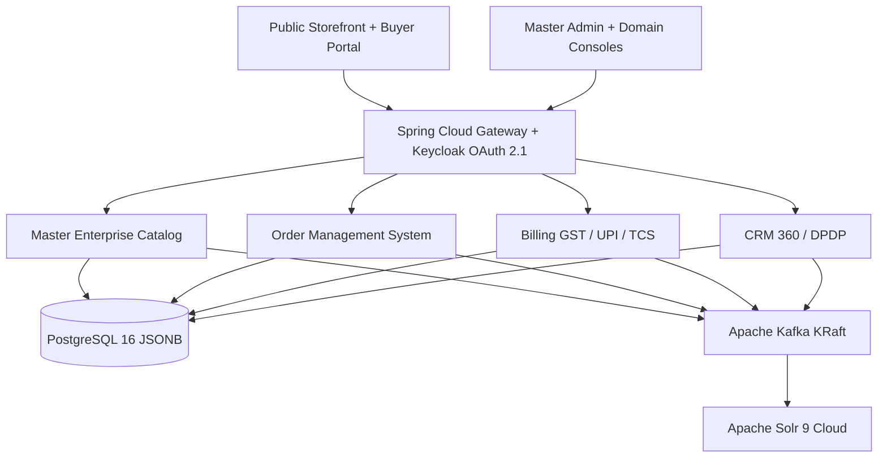

# Enterprise Commerce Suite

Open-source public project owned by **Pawan Gunjkar** (`pawangunjkar@gmail.com` · [GitHub](https://github.com/Pawangunjkar)).

Open-source enterprise e-commerce platform for the Indian commerce ecosystem. Five autonomous parent modules share contracts only through `platform-infrastructure/shared-libraries`. Licensed under MIT. See `OWNER.md` and `LICENSE`.

MCP servers: [enterprise-commerce-mcps](https://github.com/Pawangunjkar/enterprise-commerce-mcps). LangGraph business agents: [enterprise-commerce-agents](https://github.com/Pawangunjkar/enterprise-commerce-agents).

## Architecture



## Module map

| Parent folder | Responsibility |
| --- | --- |
| `platform-infrastructure/` | Gateway, Keycloak realm, Solr indexer, pincode, notifications, DLQ, MCA audit, shared libraries, React 19 monorepo |
| `master-enterprise-catalog/` | SKU lifecycle, variants, IMEI, CPQ, offers, temporal activation, DAM, bulk import |
| `order-management-system/` | Cart, checkout, saga, dynamic price, ATP, WMS, ONDC, carriers, NDR, BOPIS |
| `billing-system/` | GST CGST/SGST vs IGST, TCS 194O, BharatQR, plugins, invoices, GAAP ledger, dunning |
| `customer-relationship-management/` | Mobile OTP, assisted sales, B2B trees, tickets, loyalty, cart recovery, DPDP |

## Local quickstart

Infrastructure only (Postgres, Redis, Kafka, Solr, MinIO, Keycloak):

```bash
docker compose -f docker-compose.infra.yml up -d
```

All microservices + portals (package JARs first — this starts every Spring Boot app together):

```bash
mvn -DskipTests package
docker compose -f docker-compose.infra.yml -f docker-compose.apps.yml up -d --build
```

Then open http://localhost:5173 (storefront) and http://localhost:8080 (API gateway).

Host-mode Java (without app containers):

```bash
mvn -pl platform-infrastructure/api-gateway spring-boot:run
cd platform-infrastructure/frontend-monorepo
npm install
npm run dev --workspace=ecommerce-storefront-portal
```

Standalone domain build:

```bash
mvn -f master-enterprise-catalog/pom.xml clean install
mvn -Pbuild-oms -DskipTests install
```

Keycloak: http://localhost:8081 (`admin` / `admin`), realm `ecs`.
Solr: http://localhost:8983/solr/#/products
Storefront: http://localhost:5173
Master admin: http://localhost:5174

## India-specific engines

- **GST**: intra-state `CGST+SGST`, inter-state `IGST`, slabs 0/5/12/18/28, e-way bill payload when taxable value exceeds ₹50,000.
- **TCS**: Section 194O 1% on GMV.
- **UPI**: Dynamic BharatQR `upi://pay?pa=...&cu=INR` with Base64 PNG and intent URLs for GPay / PhonePe / Paytm / CRED.
- **Pincode**: serviceability, ODA flag, EDD from origin vs destination state.
- **IMEI**: 15-digit Luhn validation on ingest.
- **OMS checkout saga**: persists `commerce_order` + `checkout_saga`, then ATP lock → UPI authorize (or COD) → WMS wave → capture + GST invoice, with compensating unlock/void/cancel.
- **Cross-sell / up-sell**: `POST /api/v1/recommendations` ranks affinity rules (frequently bought together) plus a same-family SKU ladder.
- **DPDP Act 2023**: consent capture and anonymization endpoints.

## Frontend suite

Turborepo under `platform-infrastructure/frontend-monorepo/`:

- `ecommerce-storefront-portal` — faceted search, variant matrix, festival countdown, pincode EDD, BharatQR checkout, order radar
- `master-admin-portal` — GMV/AOV KPIs and console switcher
- `catalog-admin-studio`, `order-admin-portal`, `billing-admin-portal`, `crm-admin-portal`

## Tech stack

Java 21 virtual-thread ready, Spring Boot 3.3.5, Spring Cloud 2023.0.3, PostgreSQL 16, Kafka KRaft, Solr 9.7, Redis 7, Keycloak 24, React 19, Vite 6, Tailwind, TanStack Query.

Caffeine local cache (pincode, product, GST, prices) plus Redis for carts/price keys. Inbound Redis token-bucket on the gateway; outbound Resilience4j rate limiter + circuit breaker on every RestClient call to another microservice.

## Owner

- Name: Pawan Gunjkar
- Email: pawangunjkar@gmail.com
- GitHub: https://github.com/Pawangunjkar
- Visibility: public open source (MIT)

